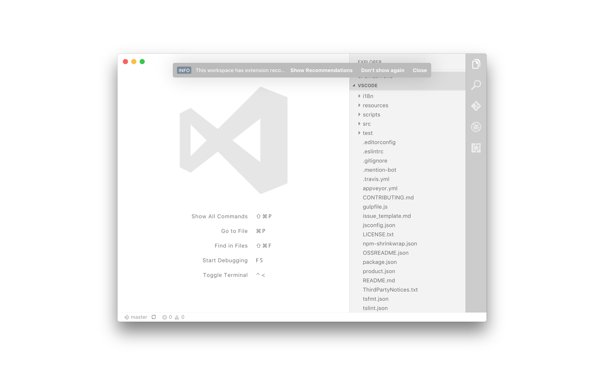

A pragmatic [fork of flagello/Essence](https://github.com/flagello/Essence) mixing my [inline toolbar style](https://github.com/Microsoft/vscode/pull/12628)



---

## Using

### Traffic Lights

_note_ once [#12628](https://github.com/Microsoft/vscode/pull/12628) is merged this won't need to happen.

You need to change the traffic light position, this is controlled by `titleBarStyle` on a new Window.

Open the workbench:

```
code /Applications/Visual\ Studio\ Code.app/Contents/Resources/app/out/vs/code/electron-main/main.js
```

Set the user setting `"window.titleBarStyle": "custom"`.

##### `1.8.0`

Edit `(w.titleBarStyle="hidden",` to be `(w.titleBarStyle="hidden-inset",`.

### Colors

You need to use the extension "[Custom CSS and JS Loader](https://github.com/be5invis/vscode-custom-css)" - search and install it.

Then clone this repo.

```
git clone https://github.com/orta/Essence.git
```

Set a user preference for your custom CSS:

```
  "vscode_custom_css.imports": [
      "file:///Users/orta/dev/misc/Essence/essence.css"
  ],
```

Run the command "Enable Custom CSS and JS".

Restart VS Code.

### Done

You will see "Your Code installation appears to be corrupt. Please reinstall." on every new window, press escape to make it go away. You have modded VS Code

I use the color theme "Ayu Light".
